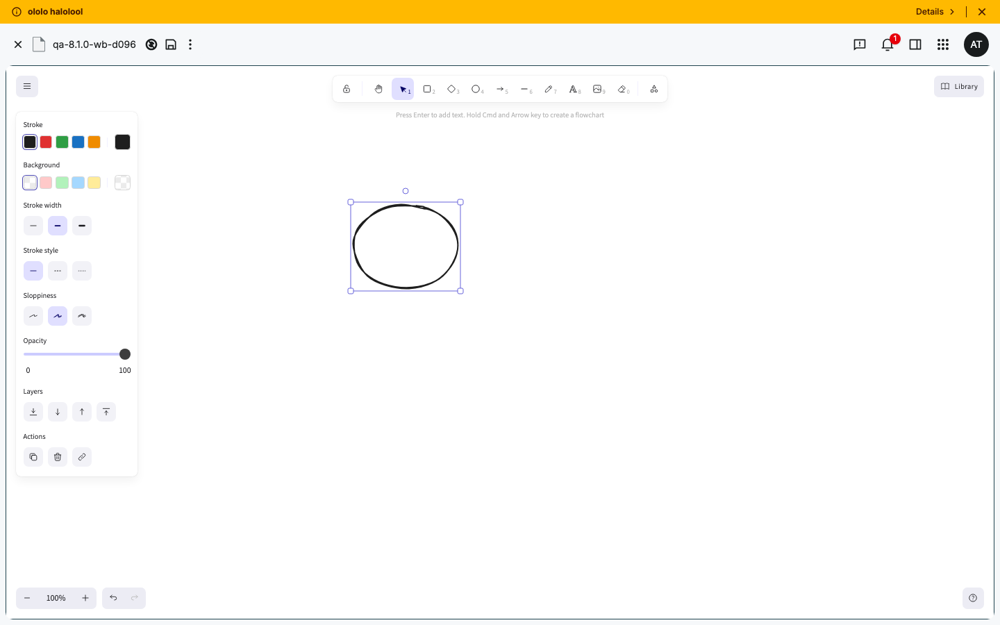

# Exploratory test report — OpenCloud 8.1.0 (rolling)

**Instance:** https://cloud.opencloud.test · **Server:** 8.1.0 · **Web:** 8.1.0 · **Reva:** 2.51.0
**Release issue:** _n/a_ · **Changelog:** https://github.com/opencloud-eu/opencloud/releases/tag/v8.1.0 · **Charters:** [charters.md](charters.md)
**Date / duration:** 2026-10-08, ~90 min · **Agent:** Claude Code · **Browser:** Chromium (desktop 1440×900, Pixel 7)
**Users:** admin, dennis, margaret, alan, lynn, mary

## Summary
| Severity | Count |
|---|---|
| Blocker | 0 |
| Major | 0 |
| Minor | 1 |
| Question | 1 |

Release recommendation from the agent: **go with known issues** — all P1 features tested (Excalidraw, create-space-with-options, editor TOC/markdown/code-blocks, editor roles, admin users/groups) work; the only confirmed defect is console/CSP noise from Excalidraw loading fonts off an external CDN. One flagship behaviour (Excalidraw persistence after reload) could not be automated reliably and should get a quick manual check. (Final decision: test manager.)

## Findings

### C1 Excalidraw whiteboard loads fonts from external CDN (esm.sh), blocked by CSP — Minor
- **Charter / PR:** C1 / oc Yjs, web#3483 (Excalidraw)
- **Role / viewport:** alan, desktop
- **Steps:**
  1. New → Whiteboard → create/open an `.excalidraw` file.
  2. Watch the browser console.
- **Actual:** ~470 console errors per load (471 and 473 on two runs). Dominant group, repeated per font file:
  `Loading the font 'https://esm.sh/@excalidraw/excalidraw@0.18.1/dist/prod/fonts/Xiaolai/…woff2' violates … "font-src 'self'". The action has been blocked.` The CJK (Xiaolai) font never loads; whiteboard depends on esm.sh at runtime.
- **Expected:** Fonts served from the instance (`'self'`); clean console; no third-party CDN dependency.
- **Evidence:**  · draft: [issues/C1-excalidraw-fonts-csp.md](issues/C1-excalidraw-fonts-csp.md) · console: `font-src 'self'` violations ×~460 + `unzip/arcade` federation errors
- **Reproduced:** 2/2 · **Known issue:** no (searched web + opencloud)
- **Likely component:** Excalidraw web extension font loading / instance CSP `font-src`

### C1 Excalidraw drawing may not persist after reload — Question (not confirmed)
- **Charter / PR:** C1 / web#3483, oc Yjs (#3398/#3397)
- **Role / viewport:** alan, desktop
- **Steps:** draw a shape → save → reload the page.
- **Actual:** One run showed an empty canvas after reload — but that file's `.excalidraw` extension had been stripped by the test harness, which also breaks reopen. Later clean-extension runs could not reliably register a drag-draw via automation, so persistence is **unverified**.
- **Expected:** Shapes drawn and saved reappear after reload.
- **Evidence:** inconclusive (not committed) — see log.md C1 section.
- **Reproduced:** 0/2 cleanly · **Action:** needs a 1-minute manual check (draw → save → reload). Not raised as a bug.

## Coverage
| Charter | Title | Priority | Result | Notes |
|---|---|---|---|---|
| R0 | Regression smoke | P1 | ✅ passed | create/upload/open/rename/delete/restore/share-user/public-link/search all work (alan, list view) |
| C1 | Excalidraw whiteboard | P1 | ⚠️ findings | create/draw/list work; 1 Minor (CSP fonts); persistence = open Question |
| C2 | Create space with options | P1 | ✅ passed | Options dialog: image/icon, subtitle, description, quota, members, **E2E-encrypt toggle**; created OK |
| C3 | Editor TOC / markdown / code blocks | P1 | ✅ passed | .ocnote rich editor: md shortcuts render, code block + language, Outlines/TOC; .md = source editor; content persists |
| C4 | Editor external-change conflicts | P1 | ➖ not tested | needs a server-side write while editor open; no scriptable WebDAV auth |
| C5 | New editor roles | P1 | ✅ passed | roles Can view / Can view (secure, watermark) / Can edit; shared to lynn as "Can edit" OK |
| A1 | Admin users & groups | P1 | ✅ passed | redesigned edit panel, Login-allowed toggle, quota; user search by name/username/email (on Enter) #3517 works |
| C6 | Consistent sorting | P2 | ➖ not tested | — |
| C7 | Right sidebar harmonization | P2 | ➖ not tested | sidebar panels seen during R0/C5 look consistent |
| C8 | Save As dialog | P2 | ➖ not tested | — |
| C9 | Shares neighbours | P2 | ➖ not tested | share user + public link verified in R0/C5 |
| A2 | Admin spaces/apps/sorting | P2 | ➖ not tested | admin spaces page loads |
| M1 | Mobile web UI | P2 | ➖ not tested | — |
| P1 | Web performance & i18n | P2 | ➖ not tested | pages load fast; German admin UI renders |
| S1 | Full-text search & reindex | P2 | ➖ not tested | search input present |
| O1 | Office / WOPI | P2 | ➖ not tested (present) | office formats (.odt/.ods/.odp) in New menu; engine not probed |
| G1 | Guest invite | P1 | ➖ not tested | not confirmed enabled |
| V1 | Vaults / encrypted spaces | P3 | ➖ not tested (present) | E2E-encrypt toggle exists in create-space dialog |

## Not tested (and why)
- User chose to wrap up after P1 coverage; P2 + conditional charters were not executed within the time budget.
- C4 needs an out-of-band server-side write to a file open in the editor; scriptable WebDAV auth (basic/bearer) was not available, so the conflict notification could not be triggered reliably.
- O1/G1/V1 features are present on the instance (office formats, E2E-encrypt toggle) but were not functionally exercised.

## Observations (not bugs)
- Every page load logs `cannot load external application unzip / arcade as applicationPath is not a valid module federation remote entry` — looks like instance app config (apps registered but not served), not a release change.
- Default file view is **tiles**; list view must be chosen from the view-mode toggle (URL `view-mode` param is ignored).
- Trash ("Deleted files") lists **per-space trash bins**; you open a space's bin to see/restore its files.
- "Create a new file" pre-fills `New file.<ext>` with only the basename selected; if a user deletes the extension, the created file can't be reopened ("No preview available"). Edge case; consider validating/forcing the extension (cf. web#3468 for Save As).
- Admin user search filters on **Enter** (server-side), not as-you-type.
- Space names reject `/ \ . : ? * " > < |` (so names containing dots are correctly rejected).

## Test data created
Prefix `qa-8.1.0-` (and `qa-810-` for spaces, since dots are invalid in space names) — users: none created; files/folders in alan's Personal space (created and cleaned up each run); one project space `qa-810-space-…` (margaret). Share: alan→lynn on a test file.

## Log
See [log.md](log.md).
